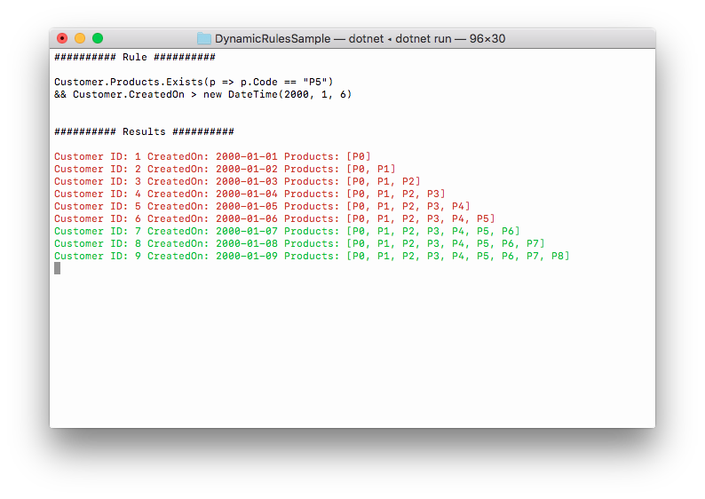

# Dynamic Rules Sample with Roslyn

Dynamic rules evaluation using [.NET Roslyn Scripting API](https://github.com/dotnet/roslyn/wiki/Scripting-API-Samples)

Sample project to implement a business dynamic rules engine using .NET Roslyn Scripting API. The class **_Evaluate.cs_** is currently used in a production environment, the rest of the code is only used for this demo.

```csharp
// Get dummy data and rule to evaluate
var customers = Dummy.Data.Customers(9);
var ruleExpression = @"
Customer.Products.Exists(p => p.Code == ""P5"")
    && Customer.CreatedOn > new DateTime(2000, 1, 6)";

// Precompile rule
var rule = new Evaluate(typeof(Dummy.Model), ruleExpression);

// Evaluate rule for each record
foreach (var customer in customers)
{
    var result = await rule.RunAsync(new Dummy.Model(customer.ID, customer));
}
```



The only requirement to replicate this project is the **Scripting API NuGet Package**, the use of the **_Evaluate.cs_** class is optional:

```
Install-Package Microsoft.CodeAnalysis.CSharp.Scripting
```
